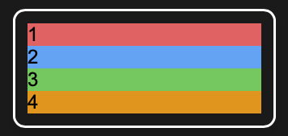

# Master CSS Grid

::: tip TLDR;

1. **What is CSS Grid?**  
   A two-dimensional layout system in CSS for creating responsive designs with rows and columns—no hacks required!

   - Start by adding `display: grid;` to a container.
   - Define structure using `grid-template-rows` and `grid-template-columns`.

2. **Placing Items in the Grid:**  
   Position grid items precisely with:

   - `grid-column` and `grid-row`: Specify start and end lines.
   - `grid-area`: Use shorthand for row and column placement.

3. **Named Grid Areas:**  
   Simplify layout management by defining and assigning semantic names to grid sections using `grid-template-areas`.

4. **Responsive Grids:**  
   Use the `fr` unit for proportional spacing and `auto-fit` with `minmax()` for dynamic layouts that adapt to screen sizes.

CSS Grid is flexible, powerful, and intuitive—perfect for modern web design. Use it!
:::

[[toc]]

## What is CSS Grid and How to Define Rows and Columns?

CSS Grid is a layout system in CSS specifically designed for creating two-dimensional layouts. Unlike older methods like floats or Flexbox (which focuses on one dimension—rows or columns), CSS Grid lets you design layouts that simultaneously handle rows and columns.

### Why CSS Grid?

Before Grid, creating complex layouts required hacks with floats, positioning, or Flexbox, which could get messy and hard to maintain. CSS Grid simplifies this by providing a clean, intuitive way to build layouts that adapt beautifully to different screen sizes.

### Getting Started with CSS Grid

To begin using CSS Grid, you need two things:

- A container element.
- Items inside the container.

Here’s an example:

```html
<div class="grid-container some-additional-class ">
  <div class="item1">1</div>
  <div class="item2">2</div>
  <div class="item3">3</div>
  <div class="item4">4</div>
</div>
```

To make the container a grid, add the following CSS:

```css
.grid-container {
  display: grid;
}
```

Congrats! You’re now using CSS Grid! :tada:

::: details Result {open}

:::

You just can't see it :sweat_smile: Because by default, this doesn’t define rows or columns. To create structure, we use **grid-template-rows** and **grid-template-columns**.

### Defining Rows and Columns

Rows and columns are defined by specifying their size using units like:

- Pixels (px): Fixed sizes.
- Percentages (%): Relative to the container.
- Fractions (fr): Relative space distribution.
- Auto: Based on content size.

Here’s an example:

```css
.grid-container {
  display: grid;
  grid-template-columns: 150px 200px auto;
  grid-template-rows: 50px auto;
}
```

**What does this do?**

Columns:

- The first column is 150px wide.
- The second column is 200px wide.
- The third column expands to fill remaining space.
- The fourth column breaks into the next line.

Rows:

- The first row is 50px tall.
- The second row adjusts automatically to fit its content.
- By mixing and matching these units, you can create incredibly flexible grids.

::: details Result {open}

:::

## Placing Items in the Grid

Now that you’ve defined rows and columns in your CSS Grid, it’s time to place items exactly where you want them. By default, items flow into the grid automatically, filling one cell at a time. However, CSS Grid gives you precise control over positioning.

### Positioning with **grid-column** and **grid-row**

To position a grid item, you can use the grid-column and grid-row properties. These let you specify:

- The starting line.
- The ending line (or how many rows/columns the item spans).

Here’s an example:

```css
.item1 {
  grid-column: 1 / 3; /* Spans from column 1 to 3 */
  grid-row: 2 / 4; /* Spans from row 2 to 4 */
}
```

In this case:

_.item1_ starts in column 1 and spans two columns (up to column 3).
It starts in row 2 and spans two rows (up to row 4, but since we only have two rows, it's not visible).

**Using Shorthand**

Instead of writing grid-column and grid-row separately, you can use the shorthand grid-area:

```css
.item1 {
  grid-area: 2 / 1 / 4 / 3; /* Row-start / Column-start / Row-end / Column-end */
}
```

This achieves the same result but keeps the code more compact.

::: details Result {open}

:::

**Default Placement**

If you don’t specify placement, Grid will automatically place items in the next available cell. This is great for simple layouts, but for more complex designs, custom placement is needed.

### Example

Let’s combine everything into a complete example:

```css
.grid-container {
  display: grid;
  grid-template-columns: 150px 1fr 150px;
  grid-template-rows: 50px auto 50px;
}

.item1 {
  background-color: #ff6b6b;
  grid-column: 1 / 4; /* Spans all columns */
  grid-row: 1; /* Stays in the first row */
}

.item2 {
  background-color: #4dabf7;
  grid-column: 2; /* Stays in the second column */
}

.item3 {
  background-color: #51cf66;
  grid-column: 1; /* Stays in the first column */
  grid-row: 2; /* Stays in the second row */
}

.item4 {
  background-color: #f59f00;
  grid-row: 3; /* Stays in the third row */
}
```

::: details Result {open}

:::

With these simple rules, you can precisely control where items appear in your layout.

## Simplify Layouts with Named Grid Areas

Named grid areas take the guesswork out of positioning. Instead of using numeric lines, you assign semantic labels to different parts of the grid.

### Defining Named Areas

Here’s how you define named grid areas:

```css
.grid-container {
  display: grid;
  grid-template-areas:
    "header header"
    "sidebar content"
    "footer footer";
}
```

This grid has:

- A header spanning two columns.
- A sidebar and content sharing the second row.
- A footer spanning two columns.

**Assigning Items to Areas**
Now assign the grid items to the named areas:

```css
.header {
  grid-area: header;
}
.sidebar {
  grid-area: sidebar;
}
.content {
  grid-area: content;
}
.footer {
  grid-area: content;
}
```

::: details Result {open}

:::

This approach makes your layouts far easier to understand and maintain, especially for complex designs.

**Flexibility with Named Areas**

Changing the layout is as simple as updating grid-template-areas. For example, to move the sidebar on the other side:

```css
.grid-container {
  display: grid;
  grid-template-areas:
    "header header"
    "content sidebar"
    "footer footer";
}
```

::: details Result {open}

:::

## Responsive CSS Grid with Fractions and Auto-Fit

Responsive design is crucial for modern web development, and CSS Grid makes it effortless. With tools like the fr unit and auto-fit, you can create grids that adapt seamlessly to screen sizes.

### The fr Unit

The fr unit lets you distribute available space across columns or rows. For example:

```css
.grid-container {
  display: grid;
  grid-template-areas:
    "header header header"
    "content sidebar footer";
  grid-template-columns: 1fr 3fr 1fr;
}
```

This creates a grid with three columns:

- The first and third columns take up one fraction each.
- The second column takes up three fractions.

::: details Result {open}

:::

### Auto-Fit for Dynamic Grids

To create grids that adjust based on available space, use auto-fit with repeat and minmax:

```css
.container {
  display: grid;
  grid-template-columns: repeat(auto-fit, minmax(100px, 1fr));
}
```

What this does:

- The auto-fit keyword creates as many columns as will fit in the container.
- Each column is at least 100px wide but can grow to share space with other columns.

::: details Result {open}

:::

When the screen get's smaller, the areas break into new rows, so that the min-width of 100px is kept:

::: details Responsive Result (Screen < 400px) {open}

:::

Eventually each item will end up in a seperate row:

::: details Responsive Result (Screen < 200px) {open}

:::

## Conclusion

With CSS Grid, creating responsive, flexible layouts is easier than ever. Start experimenting with these techniques to transform your designs!
